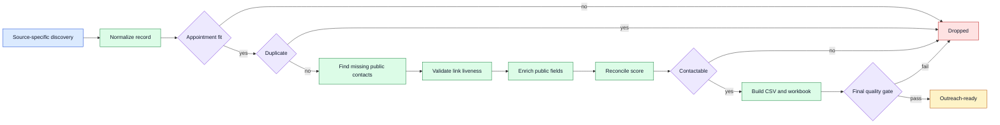

# Dental Lead Qualification: Case Study

A plausible URL can be the wrong business. A blocked page is not necessarily dead.

This is how I built a lead pipeline that treats those as two separate problems, and
refuses to call a record usable until it survives every check.

> **Engineering write-up. No runnable code.** The scraper, private operating rules,
> and collected lead data stay out of this repository.

## Problem

Lead lists become unreliable when discovery, identity matching, liveness checks,
enrichment, scoring, and spreadsheet formatting are mixed together. Re-running a score
update can accidentally stack points. A scraper process can finish successfully and
still produce an unusable workbook.

Being scraped does not make a record outreach-ready. It has to survive validation,
deduplication, contactability checks, and a final quality gate.

## How it works

The private system produces source-specific CSV and workbook deliverables with an
audit trail.

## Key decisions

- Each source gets its own adapter. The qualification logic is shared.
- Does this page belong to the clinic, and is this page live, are separate jobs.
- Uncertain, blocked, or login-gated pages become `Needs manual review`, not facts.
- Score changes reconcile from prior evidence instead of adding the same points again.
- Owner-name enrichment serves personalization and does not change lead quality.
- Source outputs stay separate until a final cross-source reconciliation.
- The operating docs label current behavior and planned extensions separately.

## Safeguards

- Paid sources stop for a credit and resume-state preflight until explicitly approved.
- Scrapers do not invent missing contacts, services, locations, or business identities.
- Weaker enrichment results never overwrite existing verified values.
- Dead, uncertain, and unresolved links have distinct states.
- Runs are resumable and deduplicate on stable source identity before weaker name
  rules.
- CSV, workbook, audit, and run-summary counts must agree at the final gate.

## Verification

I cross-checked the architecture against the current private workflow documentation
on 2026-09-02.

## What is publicly available

- [Pipeline architecture](docs/architecture.md)
- [Synthetic data contract](docs/data-contract.md)
- [Privacy and evidence boundary](docs/privacy-and-verification.md)
- [Synthetic example records](examples/synthetic_records.json)

## Scope and limits

This repository has no runnable scraper and no benchmark suite, so it claims no public
execution, lead count, qualification accuracy rate, or live-source result. It contains
no credentials, private URLs, source scripts, lead rows, workbooks, output state,
browser profiles, paid-service details, or Git history from the private system.

- Public websites change, block automation, or expose incomplete information.
- A working page does not prove a business is a suitable outreach target.
- Scoring prioritizes review. It is not a prediction of purchase intent.
- Human review is still required before outreach and for ambiguous identity matches.
- Collection and outreach must follow applicable platform terms, privacy law, and
  anti-spam rules.

## Copyright

Copyright (c) 2026 AJ. All rights reserved. See [LICENSE.md](LICENSE.md).
