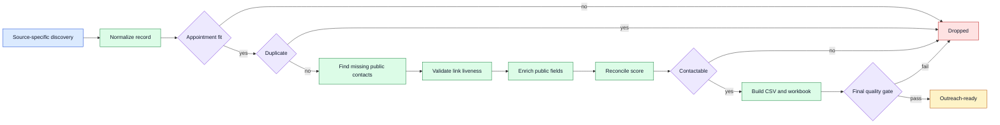

# Dental Lead Qualification: Case Study

`CASE_STUDY_ONLY` · source and lead data withheld

This repository documents a multi-stage system for finding public dental-clinic
profiles, validating contact paths, enriching missing fields, removing duplicates,
and ranking records for human outreach review. It publishes the architecture and a
synthetic data contract, not the scraper, private operating rules, or collected leads.

## Outcome

The private system produces source-specific CSV and workbook deliverables with an
audit trail. A record is not considered outreach-ready merely because it was scraped:
it must survive validation, deduplication, contactability checks, and a final quality
gate.

## Problem

Lead lists become unreliable when discovery, identity matching, liveness checks,
enrichment, scoring, and spreadsheet formatting are mixed together. A plausible URL
can be the wrong business. A blocked page is not necessarily dead. Re-running a score
update can accidentally stack points. A successful scraper process can still produce
an unusable workbook.

## System flow

## Important decisions

- Each source has its own adapter; qualification logic is shared.
- “Does this page belong to the clinic?” and “Is this page live?” are separate jobs.
- Uncertain, blocked, or login-gated pages become `Needs manual review`, not facts.
- Score changes reconcile from prior evidence instead of adding the same points again.
- Owner-name enrichment is for personalization and does not change lead quality.
- Source outputs stay separate until a final cross-source reconciliation.
- Current behavior and planned extensions are labeled separately in the operating docs.

## Safeguards

- Paid sources stop after a credit and resume-state preflight until explicitly approved.
- Scrapers do not invent missing contacts, services, locations, or business identities.
- Existing verified values are not overwritten by weaker enrichment results.
- Dead, uncertain, and unresolved links have distinct states.
- Runs are resumable and deduplicate on stable source identity before weaker name rules.
- CSV, workbook, audit, and run-summary counts must agree at the final gate.
- Collected lead data and private source code are excluded from this repository.

## Verification

The architecture was cross-checked against the current private workflow documentation
on 2026-09-02. This public repository has no runnable scraper or benchmark suite, so it
does not claim public execution, a lead count, a qualification accuracy rate, or a
current live-source result.

## Limitations

- Public websites change, block automation, or expose incomplete information.
- A working page does not prove that a business is a suitable outreach target.
- Scoring prioritizes review; it is not a prediction of purchase intent.
- Human review is still required before outreach and for ambiguous identity matches.
- Collection and outreach must follow applicable platform terms, privacy law, and
  anti-spam rules.

## What is publicly available

- [Pipeline architecture](docs/architecture.md)
- [Synthetic data contract](docs/data-contract.md)
- [Privacy and evidence boundary](docs/privacy-and-verification.md)
- [Synthetic example records](examples/synthetic_records.json)

There are no credentials, private URLs, source scripts, lead rows, workbooks, output
state, browser profiles, paid-service details, or Git history from the private system.

## Copyright

Copyright (c) 2026 AJ. All rights reserved. See [LICENSE.md](LICENSE.md).
